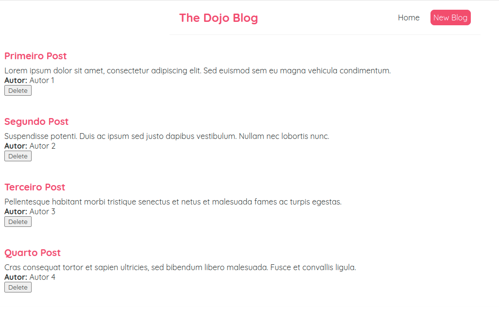

<h1 align="center">React Full Tutorial</h1>

  

## Overview 🚀

This is a project developed during the React Full Tutorial course. 

## How to Run 🚀🔧

1. **Clone the Repository:** `git clone https://github.com/tiagoskaterock/react-full-react-tutorial`
2. **Install Dependencies:** `npm install` or `yarn install`
3. **Start Development Server:** `npm start` or `yarn start`
4. **Access in Browser:** Open `http://localhost:3000` to view the application.

## Application Preview 📸

  

## Cool Stuff Used And Learned Here🛠️

- Webdev
- Javascript
- React
- Use State
- Use Effect
